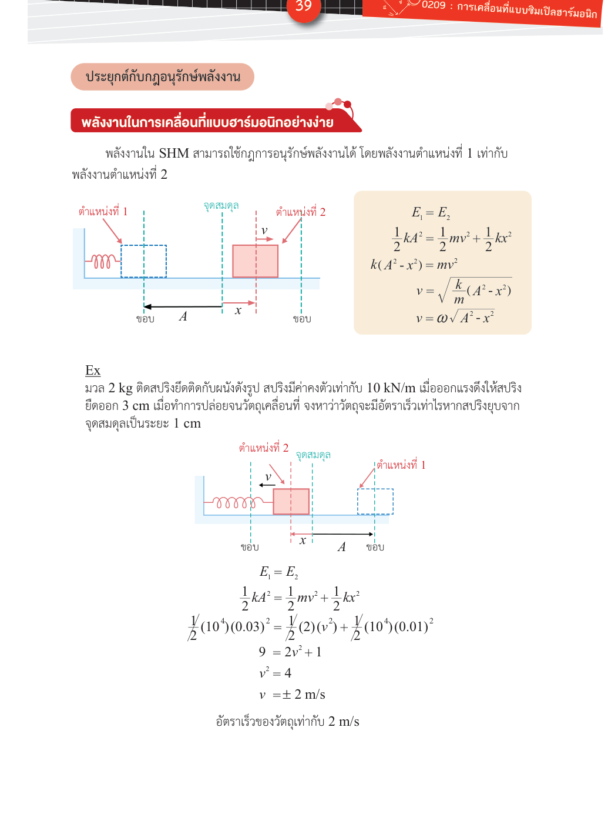

# พลังงานในการเคลื่อนที่แบบฮาร์มอนิกอย่างง่าย

**Summary**: พลังงานรวมใน SHM คงที่เท่ากับ ½kA² — พลังงานสลับไปมาระหว่าง kinetic กับ potential ตลอดการเคลื่อนที่ พร้อมสูตร v-x ที่ได้จากการอนุรักษ์พลังงาน

**Curriculum anchor**:
- กลุ่มกลศาสตร์ › การเคลื่อนที่แบบฮาร์มอนิกอย่างง่าย (Special Topic — เกินผลการเรียนรู้ขั้นต่ำของ IPST แต่อยู่ในขอบเขต O-NET/PAT/TCAS)

**Level**: มัธยมปลาย (Special Topic)

**Prerequisites**: [[shm-spring-mass]], [[shm-equations-graphs]]

**Sources**: (source: [OE-Textbook]-SHM.pdf), (source: [International-Textbook]-SHM.pdf)

**Last updated**: 2026-05-15

---

## พลังงานใน SHM คงที่ไหม?

ใช่ — ในระบบ SHM อุดมคติ (ไม่มีแรงเสียดทาน) พลังงานกลรวมคงตัวตลอดเวลา เพียงแต่รูปแบบของพลังงานสลับไปมาระหว่าง:

- **พลังงานจลน์ (kinetic energy)** $K = \frac{1}{2}mv^2$ — มากที่สุดที่จุดสมดุล
- **พลังงานศักย์ยืดหยุ่น (elastic potential energy)** $U = \frac{1}{2}kx^2$ — มากที่สุดที่ขอบ

---

## พลังงานรวม

เมื่อวัตถุอยู่ที่ตำแหน่งใดๆ $x$ ด้วยความเร็ว $v$:

$$E = K + U = \frac{1}{2}mv^2 + \frac{1}{2}kx^2$$

พลังงานรวมนี้เท่ากับพลังงานศักย์ที่ขอบ (ตอนนั้น $v = 0$):

$$\boxed{E = \frac{1}{2}kA^2}$$

(source: [International-Textbook]-SHM.pdf)

---

## ค่าพลังงานที่ตำแหน่งสำคัญ

| ตำแหน่ง | $x$ | $v$ | $K$ | $U$ |
|---|---|---|---|---|
| ขอบ (ปล่อยมือ) | $\pm A$ | 0 | 0 | $\frac{1}{2}kA^2$ |
| สมดุล | 0 | $\pm v_\text{max}$ | $\frac{1}{2}kA^2$ | 0 |
| ตำแหน่งใดๆ | $x$ | $v$ | $\frac{1}{2}mv^2$ | $\frac{1}{2}kx^2$ |

ที่ขอบ: พลังงานทั้งหมดเป็น potential
ที่สมดุล: พลังงานทั้งหมดเป็น kinetic

---

*(พลังงานที่ตำแหน่ง 1 (ขอบ) = พลังงานที่ตำแหน่ง 2 (ตำแหน่งใดๆ) — หลักการอนุรักษ์พลังงาน; source: [OE-Textbook]-SHM.pdf)*

---

## สูตรความเร็ว-การกระจัด (สูตรทอง)

จาก $E = K + U$:

$$\frac{1}{2}kA^2 = \frac{1}{2}mv^2 + \frac{1}{2}kx^2$$

$$kA^2 = mv^2 + kx^2$$

$$mv^2 = k(A^2 - x^2)$$

$$v^2 = \frac{k}{m}(A^2 - x^2) = \omega^2(A^2 - x^2)$$

$$\boxed{v = \pm\omega\sqrt{A^2 - x^2}}$$

สูตรนี้มีประโยชน์มากสำหรับโจทย์ที่บอกตำแหน่งแล้วถามความเร็ว (หรือกลับกัน) **โดยไม่ต้องรู้เวลา** (source: [OE-Textbook]-SHM.pdf)

> **สังเกต**: สูตรนี้เหมือนกับที่เรา derive จากวงกลมสมมติใน [[shm-equations-graphs]] — ทั้งสองวิธีให้ผลลัพธ์เดียวกัน

---

## ตัวอย่างการคำนวณ

**โจทย์**: มวล 2 kg ติดสปริง $k = 10{,}000\ \text{N/m}$ ดึงสปริงออก 3 cm แล้วปล่อย เมื่อวัตถุอยู่ที่ตำแหน่ง 1 cm จากสมดุล วัตถุมีอัตราเร็วเท่าใด

**วิธีทำ**: ใช้การอนุรักษ์พลังงาน

$$\frac{1}{2}kA^2 = \frac{1}{2}mv^2 + \frac{1}{2}kx^2$$

$$\frac{1}{2}(10^4)(0.03)^2 = \frac{1}{2}(2)v^2 + \frac{1}{2}(10^4)(0.01)^2$$

$$9 = v^2 + 1$$

$$v^2 = 8 \implies v = \pm 2\sqrt{2} \approx \pm 2.83\ \text{m/s}$$

(source: [OE-Textbook]-SHM.pdf)

---

## ความเข้าใจคลาดเคลื่อนที่พบบ่อย

| ❌ เข้าใจผิด | ✅ ที่ถูกต้อง |
|---|---|
| พลังงาน K และ U สลับกันแต่ไม่เท่ากัน | $K + U = \frac{1}{2}kA^2$ คงตัวเสมอ เมื่อ K มากขึ้น U น้อยลงในปริมาณเท่ากันพอดี |
| ที่จุดสมดุล พลังงานรวมเป็นศูนย์ | ที่สมดุล $U = 0$ แต่ $K = \frac{1}{2}kA^2$ — พลังงานรวมยังอยู่ครบ เพิ่งแปลงรูปมาเป็น kinetic ทั้งหมด |
| ความเร็วสูงสุดขึ้นกับตำแหน่งเริ่มต้น (เฟส) | ขึ้นกับแอมพลิจูด $A$ เท่านั้น $v_\text{max} = \omega A$ ไม่ว่าจะปล่อยจากตำแหน่งใดก็ตาม |

## Related pages

- [[shm-spring-mass]]
- [[shm-equations-graphs]]
- [[shm-pendulum]]
- [[shm-other-forms]]
