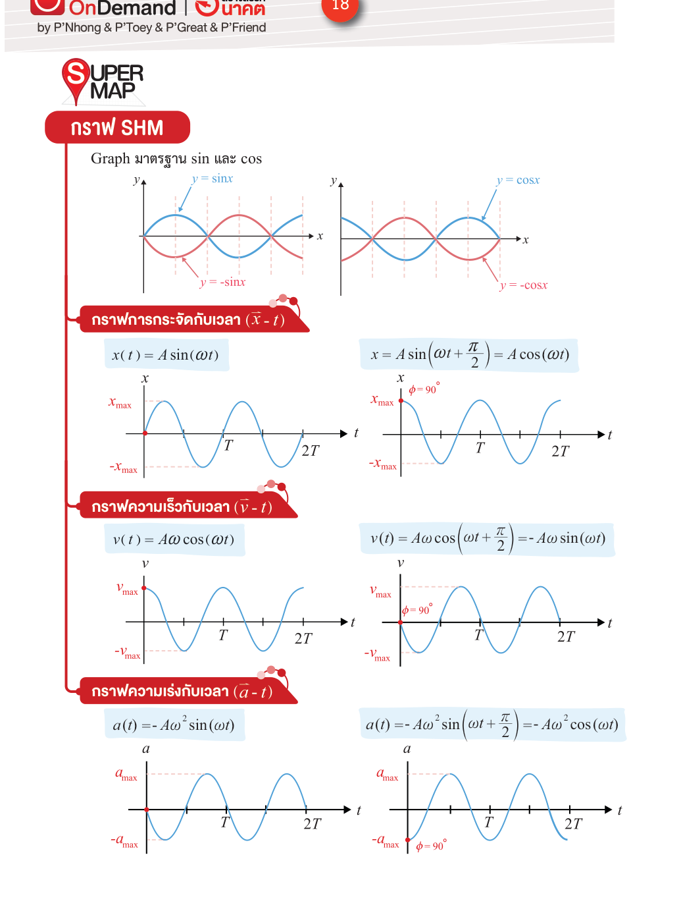
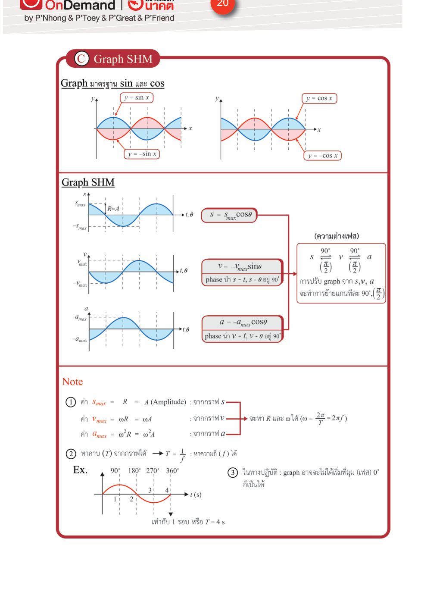

# สมการและกราฟการเคลื่อนที่แบบฮาร์มอนิกอย่างง่าย

**Summary**: สมการ x(t), v(t), a(t) ของ SHM พร้อมที่มาจากวงกลมสมมติ กราฟความสัมพันธ์กับเวลา และกฎการเลือกใช้ฟังก์ชัน sin หรือ cos ตามเฟสเริ่มต้น

**Curriculum anchor**:
- กลุ่มกลศาสตร์ › การเคลื่อนที่แบบฮาร์มอนิกอย่างง่าย › สมการการเคลื่อนที่แบบฮาร์มอนิกอย่างง่าย › สมการปริมาณการเคลื่อนที่กับเวลาในการเคลื่อนที่แบบฮาร์มอนิกอย่างง่าย
- กลุ่มกลศาสตร์ › การเคลื่อนที่แบบฮาร์มอนิกอย่างง่าย › สมการการเคลื่อนที่แบบฮาร์มอนิกอย่างง่าย › การหาค่าสูงสุดและตำแหน่งสูงสุดในสมการของการเคลื่อนที่แบบฮาร์มอนิกอย่างง่าย
- กลุ่มกลศาสตร์ › การเคลื่อนที่แบบฮาร์มอนิกอย่างง่าย › สมการการเคลื่อนที่แบบฮาร์มอนิกอย่างง่าย › กราฟของปริมาณการเคลื่อนที่กับเวลาในการเคลื่อนที่แบบฮาร์มอนิกอย่างง่าย

**Level**: มัธยมปลาย

**Prerequisites**: [[shm-definition]], [[circular-motion]]

**Sources**: (source: [IPST-Textbook]-SHM.pdf — authoritative), (source: [OE-S-Map]-SHM.pdf), (source: [IPST-Teacher-Manual]-SHM.pdf)

**Last updated**: 2026-05-15

---

## แนวคิดหลัก — วงกลมสมมติ

สมการ SHM ทั้งหมดสร้างมาจาก **วงกลมสมมติ (reference circle)** : วงกลมรัศมี $A$ ที่มีหมุดหมุนด้วยความถี่เชิงมุม $\omega$ สม่ำเสมอ การกระจัดของวัตถุ SHM ณ เวลาใดๆ คือเงาของหมุดบนแกนนอน

เริ่มต้นด้วยกรณีที่ที่ $t = 0$ หมุดอยู่ที่มุม $\phi$ จากแกนนอน มุมรวมที่เวลาใดๆ คือ $\phi + \omega t$ เรียกว่า **มุมเฟส (phase angle)**

---

## สมการการกระจัด

จากวงกลมสมมติ เงาของหมุดบนแกนนอน:

$$\boxed{x(t) = A\sin(\omega t + \phi)}$$

เมื่อ $\phi$ คือ **เฟสเริ่มต้น (initial phase)** — มุมของหมุดที่เวลา $t = 0$ (source: [IPST-Textbook]-SHM.pdf — authoritative)

> สมการนี้สามารถเขียนในรูป $\cos$ ได้เช่นกัน: $x = A\cos(\omega t + \phi')$ ซึ่งเหมือนกันทุกประการ แต่ค่า $\phi'$ จะต่างจาก $\phi$ ไป $\frac{\pi}{2}$

---

## สมการความเร็ว

หาความเร็วโดยอนุพันธ์ $x(t)$ ตามเวลา:

$$v(t) = \frac{dx}{dt} = A\omega\cos(\omega t + \phi)$$

$$\boxed{v(t) = A\omega\cos(\omega t + \phi)}$$

ความเร็วสูงสุด (ที่ตำแหน่งสมดุล $x = 0$):

$$v_\text{max} = A\omega$$

**ความสัมพันธ์ความเร็ว–การกระจัด** (ไม่ขึ้นกับเวลา): จากการยกกำลังสองของ $\frac{x}{A} = \sin(\omega t + \phi)$ และ $\frac{v}{A\omega} = \cos(\omega t + \phi)$ แล้วบวกกัน:

$$\boxed{v = \pm\omega\sqrt{A^2 - x^2}}$$

สูตรนี้มีประโยชน์มากสำหรับโจทย์ที่ให้ตำแหน่งแล้วถามความเร็ว (source: [IPST-Textbook]-SHM.pdf — authoritative)

---

## สมการความเร่ง

หาความเร่งโดยอนุพันธ์ $v(t)$ ตามเวลา:

$$a(t) = \frac{dv}{dt} = -A\omega^2\sin(\omega t + \phi)$$

$$\boxed{a(t) = -A\omega^2\sin(\omega t + \phi)}$$

ความเร่งสูงสุด (ที่ตำแหน่งขอบ $x = \pm A$):

$$a_\text{max} = A\omega^2$$

ลองเอา $x = A\sin(\omega t + \phi)$ แทนลงไปในสมการความเร่ง จะเห็นว่า:

$$\boxed{a = -\omega^2 x}$$

นี่คือ **สมบัติที่โดดเด่นที่สุด** ของ SHM: ความเร่งแปรผันตรงกับการกระจัด มีขนาดสัดส่วน $\omega^2$ และมีทิศตรงข้ามเสมอ (source: [IPST-Textbook]-SHM.pdf — authoritative)

---

## สรุปค่าสูงสุด

| ปริมาณ | ค่าสูงสุด | เกิดที่ตำแหน่ง |
|---|---|---|
| การกระจัด $x$ | $A$ | ขอบ |
| ความเร็ว $v$ | $A\omega$ | สมดุล ($x = 0$) |
| ความเร่ง $a$ | $A\omega^2$ | ขอบ ($x = \pm A$) |

---

## กราฟ x-t, v-t, a-t

กราฟทั้งสามมีรูปร่างเป็นคลื่น sin หรือ cos ขึ้นอยู่กับเฟสเริ่มต้น สังเกตความสัมพันธ์ระหว่างกราฟ:

- $v(t)$ นำหน้า $x(t)$ อยู่ **90°** (หรือ $\frac{\pi}{2}$ เรเดียน)
- $a(t)$ นำหน้า $v(t)$ อยู่ **90°** อีกครั้ง (หรือตรงข้ามกับ $x(t)$ พอดี)

กล่าวอีกนัยหนึ่ง: **ขณะที่ $x$ มีค่าสูงสุด → $v = 0$ และ $a$ มีค่าสูงสุด (ทิศตรงข้าม)** และ **ขณะที่ $x = 0$ → $v$ มีค่าสูงสุด และ $a = 0$**

*(กราฟการกระจัด ความเร็ว และความเร่ง เทียบกับเวลา — สังเกตว่า v นำหน้า x อยู่ 90° และ a ตรงข้ามกับ x พอดี; source: [OE-Textbook]-SHM.pdf)*

---

## sin กับ cos — ต่างกันยังไง ใช้อะไรก็ได้ไหม?

นักเรียนหลายคนเห็นตำราบางเล่มเขียน $x = A\sin(\omega t + \phi)$ และบางเล่มเขียน $x = A\cos(\omega t + \phi)$ แล้วสับสนว่าสูตรไหนถูก

**คำตอบ: ถูกทั้งคู่** — sin และ cos ต่างกันแค่เฟสเริ่มต้น $\frac{\pi}{2}$ เพราะ $\cos\theta = \sin(\theta + \frac{\pi}{2})$ สมการทั้งสองอธิบายการเคลื่อนที่เดียวกัน เพียงแต่ใช้จุด $t = 0$ ต่างกัน

| ตำรา | สมการ default | เหตุผล |
|---|---|---|
| IPST (ไทย), OE | $x = A\sin(\omega t + \phi)$ | เริ่มนับจากจุดสมดุล เป็น convention มาตรฐานไทย |
| Serway, Halliday (ต่างประเทศ) | $x = A\cos(\omega t + \phi)$ | เริ่มนับจากขอบ ทำให้ $\phi = 0$ เมื่อปล่อยจาก $x = A$ |

**ไม่มีอะไรผิด** — เลือกใช้อันที่ทำให้ $\phi$ คำนวณง่ายที่สุด

*(กราฟ sin/cos มาตรฐาน พร้อมความสัมพันธ์ phase ระหว่าง x, v, a — สังเกตว่า v นำหน้า x อยู่ 90° เสมอไม่ว่าจะเริ่มด้วย sin หรือ cos; source: [OE-Textbook]-SHM.pdf)*

(source: [IPST-Textbook]-SHM.pdf — authoritative), (source: [International-Textbook]-SHM.pdf)

---

## กฎการเลือกฟังก์ชัน sin หรือ cos

เฟสเริ่มต้น $\phi$ ขึ้นอยู่กับตำแหน่งของวัตถุที่ $t = 0$:

**กรณีเริ่มที่จุดสมดุล** ($x = 0$ ที่ $t = 0$, เคลื่อนไปทางบวก):

$$\phi = 0 \implies x = A\sin(\omega t), \quad v = A\omega\cos(\omega t), \quad a = -A\omega^2\sin(\omega t)$$

**กรณีเริ่มที่ขอบ** ($x = A$ ที่ $t = 0$):

$$\phi = \frac{\pi}{2} \implies x = A\cos(\omega t), \quad v = -A\omega\sin(\omega t), \quad a = -A\omega^2\cos(\omega t)$$

(source: [IPST-Textbook]-SHM.pdf — authoritative), (source: [OE-S-Map]-SHM.pdf)

> **เคล็ดลับ**: หาเฟสเริ่มต้นโดยแทนค่า $t = 0$ และค่า $x$ ที่ทราบในสมการ $x = A\sin(\omega \cdot 0 + \phi)$ แล้วแก้หา $\phi$

---

## จำตำแหน่งสมดุลกับขอบให้ขึ้นใจ

| ตำแหน่ง | ความเร็ว $v$ | ความเร่ง $a$ |
|---|---|---|
| สมดุล ($x = 0$) | สูงสุด ($A\omega$) | ศูนย์ |
| ขอบ ($x = \pm A$) | ศูนย์ | สูงสุด ($A\omega^2$), ทิศเข้าหาสมดุล |

วัตถุวิ่งเร็วที่สุดตรงกลาง แล้วชะลอลงเรื่อยๆ จนหยุดที่ขอบ ก่อนจะเร่งกลับมาใหม่ — ใจความเดียวกับลูกตุ้มนาฬิกา

---

## ความเข้าใจคลาดเคลื่อนที่พบบ่อย

| ❌ เข้าใจผิด | ✅ ที่ถูกต้อง |
|---|---|
| ความเร่งของวัตถุ SHM มีค่าคงตัวตลอดการเคลื่อนที่ | ความเร่งเปลี่ยนตลอดเวลาตาม $a = -\omega^2 x$ — สูงสุดที่ขอบ เป็นศูนย์ที่สมดุล ไม่เคยคงที่ |
| การกระจัดและความเร็วมีทิศทางเดียวกันเสมอ | ไม่จริง ขณะวัตถุอยู่ขวาของสมดุล ($x > 0$) แต่กำลังวิ่งกลับซ้าย — $x$ กับ $v$ ทิศตรงข้ามกัน |
| แอมพลิจูดมากกว่า → คาบนานกว่า (สั่นช้ากว่า) | $T = \frac{2\pi}{\omega}$ ไม่มี $A$ อยู่เลย คาบไม่ขึ้นกับแอมพลิจูด |

(source: [IPST-Teacher-Manual]-SHM.pdf)

## Related pages

- [[shm-definition]]
- [[shm-spring-mass]]
- [[shm-pendulum]]
