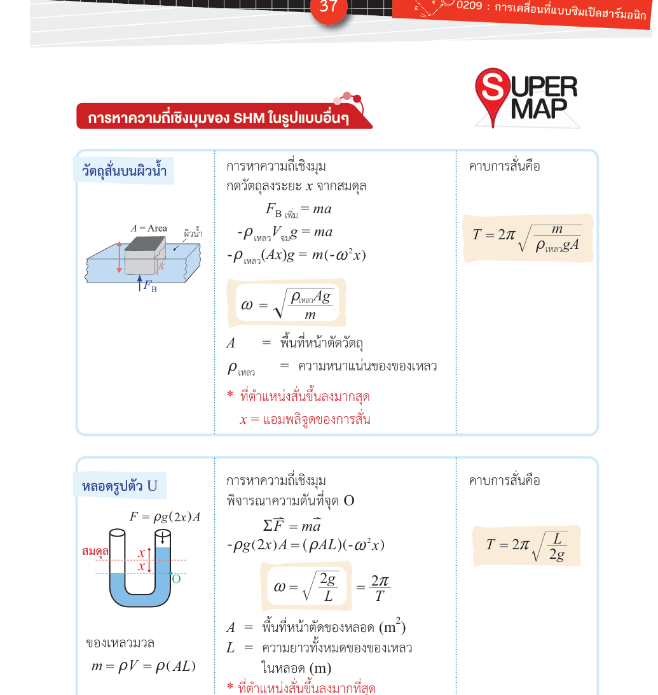

# SHM รูปแบบอื่นๆ — วัตถุลอยน้ำ หลอด U และลูกตุ้มฟิสิคัส

**Summary**: ระบบที่แสดง SHM นอกจาก spring-mass และลูกตุ้มอย่างง่าย ได้แก่ วัตถุลื่นบนผิวน้ำ หลอดรูปตัว U และ physical pendulum — ทุกระบบหา ω ได้จากหลักการเดิมคือ $F = -kx$ หรือ $\tau = -k\theta$

**Curriculum anchor**:
- เกินหลักสูตร (เกินผลการเรียนรู้ขั้นต่ำของ IPST และ OE S-Map) — เหมาะสำหรับนักเรียนที่ต้องการเนื้อหาเพิ่มเติม

**Level**: มัธยมปลาย (เกินหลักสูตร)

**Prerequisites**: [[shm-spring-mass]], [[shm-pendulum]], [[shm-equations-graphs]]

**Sources**: (source: [OE-Textbook]-SHM.pdf), (source: [International-Textbook]-SHM.pdf)

**Last updated**: 2026-05-15

---

## แนวคิดร่วม

ระบบต่อไปนี้ทุกตัวมีแรงหรือทอร์กดึงกลับที่แปรผันตรงกับการกระจัด ดังนั้นจึงเป็น SHM เหมือนกัน วิธีหา ω คือ:

1. เขียนสมการแรงหรือทอร์กที่ตำแหน่งที่เบี่ยงเบนจากสมดุล
2. จัดให้อยู่ในรูป $a = -\omega^2 x$ หรือ $\alpha = -\omega^2 \theta$
3. อ่านค่า $\omega^2$ ออกมา

---

*(วัตถุลอยน้ำ: แรงลอยตัวสุทธิเป็น restoring force สัดส่วนกับระยะที่กดลง; หลอด U: แรงหนักของ column เหลวสุทธิดึงกลับสู่สมดุล; source: [OE-Textbook]-SHM.pdf)*

---

## 1. วัตถุลื่นบนผิวน้ำ (Floating object)

วัตถุพื้นที่หน้าตัด $A$ ลอยอยู่ในของเหลวความหนาแน่น $\rho_\text{เหลว}$ ถ้ากดลงแล้วปล่อย แรงลอยตัว (buoyancy) จะผลักกลับ:

$$F_\text{net} = -\rho_\text{เหลว} A g \cdot x$$

เมื่อ $x$ คือระยะที่กดลงจากตำแหน่งสมดุล เปรียบกับ $F = -kx$ ได้ว่า "ค่าคงตัวสปริง" ของระบบนี้คือ $k_\text{eff} = \rho_\text{เหลว} A g$

$$\boxed{\omega = \sqrt{\frac{\rho_\text{เหลว} A g}{m}}} \qquad T = 2\pi\sqrt{\frac{m}{\rho_\text{เหลว} A g}}$$

(source: [OE-Textbook]-SHM.pdf)

---

## 2. หลอดรูปตัว U (U-tube)

ของเหลวในหลอด U ความหนาแน่น $\rho$ ความยาวรวม $L$ — ถ้าดันของเหลวด้านหนึ่งแล้วปล่อย ระดับสูงต่ำจะแกว่ง:

ของเหลวที่เคลื่อนเป็น column ยาว $2x$ (ด้านหนึ่งสูงขึ้น $x$ อีกด้านต่ำลง $x$) มีแรงหนักสุทธิดึงกลับ $F = -2\rho A g x$ และมวลรวมของเหลวคือ $m = \rho A L$ ดังนั้น:

$$\boxed{\omega = \sqrt{\frac{2g}{L}}} \qquad T = 2\pi\sqrt{\frac{L}{2g}}$$

เมื่อ $L$ คือความยาวรวมของของเหลวในหลอด (source: [OE-Textbook]-SHM.pdf)

---

## 3. ลูกตุ้มฟิสิคัส (Physical pendulum)

ลูกตุ้มอย่างง่ายถือว่ามวลทั้งหมดอยู่ที่จุดเดียว — แต่ถ้าวัตถุมีขนาด เช่น แท่งสม่ำเสมอ, กระดาน, ชิ้นส่วนเครื่องจักร เราต้องใช้ **ลูกตุ้มฟิสิคัส (physical pendulum)**

วัตถุหมุนรอบจุดหมุน $O$ ซึ่งอยู่ห่างจากศูนย์กลางมวลเป็นระยะ $r$ ทอร์กดึงกลับคือ $\tau = -mgr\sin\theta \approx -mgr\theta$ (สำหรับมุมเล็ก) และ $\tau = I\alpha$:

$$\alpha = -\frac{mgr}{I}\theta$$

เปรียบกับ $\alpha = -\omega^2\theta$:

$$\boxed{\omega = \sqrt{\frac{mgr}{I}}} \qquad T = 2\pi\sqrt{\frac{I}{mgr}}$$

เมื่อ $I$ คือโมเมนต์ความเฉื่อยรอบจุดหมุน $O$ (ไม่ใช่รอบจุดศูนย์กลางมวล) หาได้จากทฤษฎีแกนขนาน:

$$I = I_\text{CM} + mr^2$$

> **จุดที่สับสนบ่อย**: $r$ ในสูตรคือระยะจากจุดหมุนถึงศูนย์กลางมวล ไม่ใช่ความยาวของวัตถุ

(source: [OE-Textbook]-SHM.pdf), (source: [International-Textbook]-SHM.pdf)

---

## สรุปสูตรทุกรูปแบบ

| ระบบ | $\omega$ | $T$ |
|---|---|---|
| มวลติดสปริง | $\sqrt{k/m}$ | $2\pi\sqrt{m/k}$ |
| ลูกตุ้มอย่างง่าย | $\sqrt{g/L}$ | $2\pi\sqrt{L/g}$ |
| วัตถุลอยน้ำ | $\sqrt{\rho_\text{เหลว} Ag/m}$ | $2\pi\sqrt{m/\rho_\text{เหลว} Ag}$ |
| หลอดรูปตัว U | $\sqrt{2g/L}$ | $2\pi\sqrt{L/2g}$ |
| ลูกตุ้มฟิสิคัส | $\sqrt{mgr/I}$ | $2\pi\sqrt{I/mgr}$ |

สังเกตว่าสูตร $T = 2\pi\sqrt{m/k}$ ใช้ได้กับทุกระบบ ถ้าเรานิยาม $k_\text{eff}$ ให้ถูกต้อง

## Related pages

- [[shm-spring-mass]]
- [[shm-spring-combinations]]
- [[shm-pendulum]]
- [[shm-energy]]
