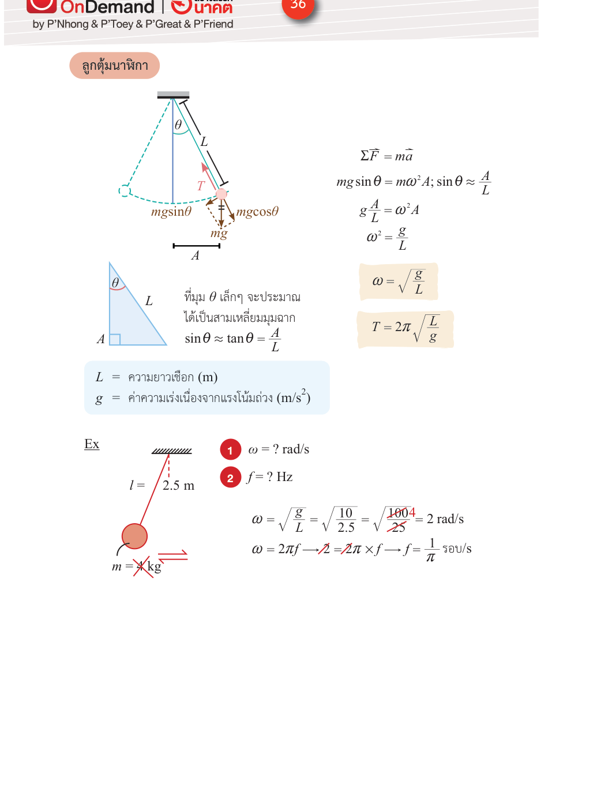

# ลูกตุ้มอย่างง่าย — คาบและความถี่

**Summary**: การแกว่งของลูกตุ้มอย่างง่ายในฐานะ SHM หา ω = √(g/l) จากเงื่อนไขมุมเล็ก สูตรคาบ และสมบัติที่ไม่ขึ้นกับมวลและแอมพลิจูด

**Curriculum anchor**:
- กลุ่มกลศาสตร์ › การเคลื่อนที่แบบฮาร์มอนิกอย่างง่าย › ความถี่เชิงมุมของการเคลื่อนที่แบบฮาร์มอนิกอย่างง่ายรูปแบบต่างๆ › การแกว่งของลูกตุ้มอย่างง่าย

**Level**: มัธยมปลาย

**Prerequisites**: [[shm-definition]], [[shm-equations-graphs]], [[newton-second-law]]

**Sources**: (source: [IPST-Textbook]-SHM.pdf — authoritative), (source: [OE-S-Map]-SHM.pdf), (source: [IPST-Teacher-Manual]-SHM.pdf)

**Last updated**: 2026-05-15

---

## รู้สึกก่อน — นาฬิกาที่เดินด้วยแรงโน้มถ่วง

ลองนึกภาพนาฬิกาลูกตุ้มเก่าๆ ลูกตุ้มแกว่งซ้าย-ขวาผ่านจุดต่ำสุดซ้ำๆ สิ่งที่น่าสังเกตคือ ไม่ว่าจะแกว่งแรงหรือแผ่ว คาบการแกว่งก็คงที่ทุกรอบ — นั่นแหละคือเหตุผลที่ใช้ทำนาฬิกาได้

แรงที่ดึงลูกตุ้มกลับสู่จุดต่ำสุดคือส่วนประกอบของแรงโน้มถ่วงตามแนวการเคลื่อนที่ นี่คือ **แรงดึงกลับ (restoring force)** ของระบบนี้

---

*(แรงที่กระทำต่อลูกตุ้ม: แรงตึงเชือก T ตามแนวเชือก + แรงโน้มถ่วง mg ลงในแนวดิ่ง — แรงดึงกลับคือ mg sinθ ตามแนวการเคลื่อนที่; source: [OE-Textbook]-SHM.pdf)*

---

## ทำไมลูกตุ้มจึงเป็น SHM (ภายใต้เงื่อนไขมุมเล็ก)

สมมติลูกตุ้มมวล $m$ ผูกด้วยเชือกยาว $l$ เมื่อลูกตุ้มเอียงทำมุม $\theta$ กับแนวดิ่ง แรงดึงกลับตามแนวการเคลื่อนที่คือ:

$$F = -mg\sin\theta$$

สำหรับ **มุมเล็ก** ($\theta < 10°$) ใช้การประมาณ **small angle approximation** ได้:

$$\sin\theta \approx \theta \approx \frac{x}{l}$$

เมื่อ $x$ คือระยะการกระจัดตามแนวโค้ง ดังนั้น:

$$F \approx -\frac{mg}{l}\,x$$

กฎข้อสองบอกว่า $F = ma$ ดังนั้น:

$$a = -\frac{g}{l}\,x$$

นิยาม SHM บอกว่า $a = -\omega^2 x$ (ดู [[shm-equations-graphs]]) เมื่อเทียบกัน:

$$\omega^2 = \frac{g}{l}$$

$$\boxed{\omega = \sqrt{\frac{g}{l}}}$$

(source: [IPST-Textbook]-SHM.pdf — authoritative)

---

## สูตรคาบและความถี่

จาก $\omega = \frac{2\pi}{T}$:

$$\boxed{T = 2\pi\sqrt{\frac{l}{g}}}$$

$$\boxed{f = \frac{1}{2\pi}\sqrt{\frac{g}{l}}}$$

---

## สมบัติสำคัญ — ดูที่ **ไม่** อยู่ในสูตร

ดูสูตร $T = 2\pi\sqrt{l/g}$ อีกครั้ง:

- **มวล $m$ ไม่อยู่ในสูตร** → คาบไม่ขึ้นกับมวล ลูกตุ้มเหล็กกับลูกตุ้มไม้ที่ความยาวเท่ากัน แกว่งด้วยคาบเดียวกัน (นี่คือหนึ่งในการค้นพบของกาลิเลโอ)
- **แอมพลิจูดไม่อยู่ในสูตร** → คาบไม่ขึ้นกับมุมที่ปล่อย ใช้ได้เฉพาะในช่วงมุมเล็ก
- เพิ่มความยาว $l$ → คาบนานขึ้น (แกว่งช้าลง)
- ค่า $g$ มากขึ้น → คาบสั้นลง (แกว่งเร็วขึ้น)

---

## ขีดจำกัดของสูตร — small angle approximation

สูตร $T = 2\pi\sqrt{l/g}$ ใช้ได้เมื่อ **$\theta \lesssim 10°$** เท่านั้น เพราะอาศัยการประมาณ $\sin\theta \approx \theta$

ถ้ามุมมากกว่านั้น คาบจริงจะนานกว่าที่สูตรทำนาย แต่สำหรับระดับมัธยม เราไม่ต้องคำนวณกรณีมุมใหญ่ (source: [IPST-Textbook]-SHM.pdf — authoritative)

---

## ตัวอย่างการคำนวณ

**โจทย์**: ลูกตุ้มยาว 25 เซนติเมตร แกว่งบนพื้นโลก ($g = 9.8\ \text{m/s}^2$) คาบการแกว่งเป็นเท่าใด

**วิธีทำ**:

$$T = 2\pi\sqrt{\frac{l}{g}} = 2\pi\sqrt{\frac{0.25\ \text{m}}{9.8\ \text{m/s}^2}} \approx 1.0\ \text{s}$$

(source: [IPST-Textbook]-SHM.pdf — authoritative)

---

## ความเข้าใจคลาดเคลื่อนที่พบบ่อย

| ❌ เข้าใจผิด | ✅ ที่ถูกต้อง |
|---|---|
| ลูกตุ้มหนักกว่า → แกว่งเร็วกว่า (คาบสั้นกว่า) | $T = 2\pi\sqrt{l/g}$ ไม่มีมวลอยู่เลย คาบไม่ขึ้นกับมวล |
| แกว่งกว้างกว่า (มุมมากกว่า) → คาบนานกว่า | ภายในช่วงมุมเล็ก ($\theta < 10°$) คาบไม่ขึ้นกับแอมพลิจูด |
| ลูกตุ้มบนดวงจันทร์แกว่งด้วยคาบเท่ากับบนโลก | ดวงจันทร์มี $g \approx 1.6\ \text{m/s}^2$ น้อยกว่าโลกประมาณ 6 เท่า ทำให้คาบนานกว่าประมาณ 2.5 เท่า |

(source: [IPST-Teacher-Manual]-SHM.pdf)

## Related pages

- [[shm-definition]]
- [[shm-equations-graphs]]
- [[shm-spring-mass]]
- [[shm-natural-frequency-resonance]]
