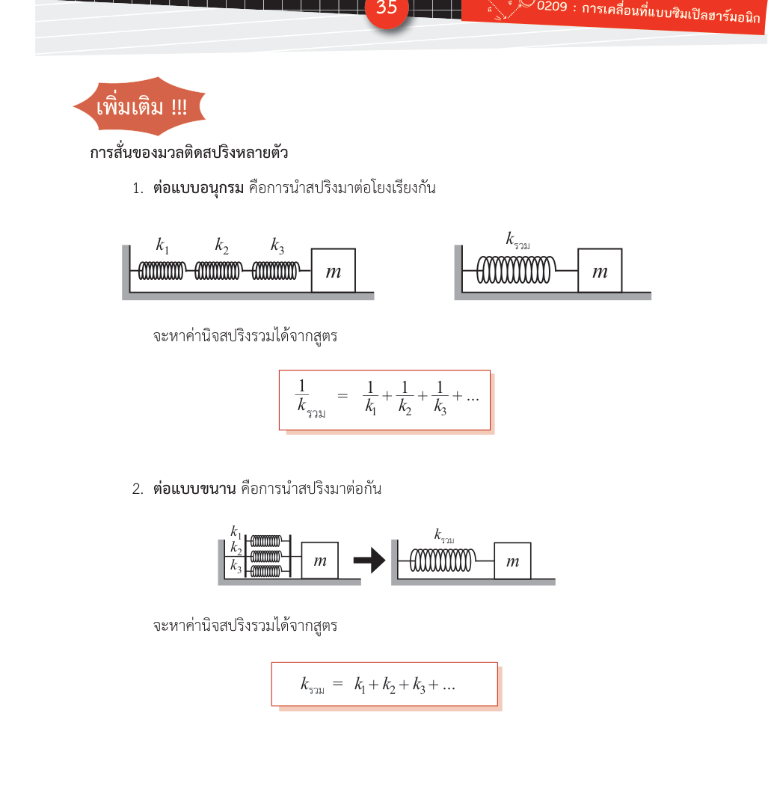

# สปริงหลายตัว — ต่ออนุกรม ต่อขนาน และการตัดสปริง

**Summary**: วิธีหาค่าคงตัวสปริงรวมเมื่อต่อสปริงหลายตัวแบบอนุกรมหรือขนาน และผลของการตัดสปริงต่อค่า k

**Curriculum anchor**:
- กลุ่มกลศาสตร์ › การเคลื่อนที่แบบฮาร์มอนิกอย่างง่าย › ความถี่เชิงมุมของการเคลื่อนที่แบบฮาร์มอนิกอย่างง่ายรูปแบบต่างๆ › การสั่นของมวลติดสปริง

**Level**: มัธยมปลาย

**Prerequisites**: [[shm-spring-mass]], [[hookes-law]]

**Sources**: (source: [OE-Textbook]-SHM.pdf)

**Last updated**: 2026-05-15

---

## แนวคิด — สปริงหลายตัวรวมกันเป็นสปริงเดียว

ถ้าระบบมีสปริงมากกว่าหนึ่งตัว เราสามารถหา **ค่าคงตัวสปริงรวม (k_รวม)** แล้วใช้ในสูตร $\omega = \sqrt{k_\text{รวม}/m}$ ได้เลย เหมือนกับที่เราทำกับสปริงตัวเดียว

วิธีคิดขึ้นอยู่กับว่าสปริงต่อกันแบบไหน


*(สปริงต่ออนุกรม — สปริงเรียงกัน แรงเท่ากัน ระยะยืดบวกกัน; ต่อขนาน — สปริงเคียงกัน ระยะยืดเท่ากัน แรงบวกกัน; source: [OE-Textbook]-SHM.pdf)*

---

## 1. ต่ออนุกรม (series)

สปริงต่ออนุกรมคือการนำสปริงมาเรียงกันเป็นแถว ปลายต่อปลาย

```
|---[k₁]---[k₂]---[k₃]---| m
```

**สมบัติ**: แรงที่ผ่านสปริงแต่ละตัวเท่ากัน แต่ระยะยืดรวมกัน ดังนั้น:

$$\boxed{\frac{1}{k_\text{รวม}} = \frac{1}{k_1} + \frac{1}{k_2} + \frac{1}{k_3} + \cdots}$$

**จำง่าย**: ต่ออนุกรม → สปริงอ่อนลง ($k_\text{รวม} < k$ ทุกตัว)

**ตัวอย่าง**: สปริง 6 N/m ต่ออนุกรมกับสปริง 3 N/m

$$\frac{1}{k_\text{รวม}} = \frac{1}{6} + \frac{1}{3} = \frac{1}{6} + \frac{2}{6} = \frac{3}{6} = \frac{1}{2}$$

$$k_\text{รวม} = 2\ \text{N/m}$$

ค่า $k_\text{รวม}$ น้อยกว่าสปริงที่อ่อนที่สุด (3 N/m) อีก — ถูกต้อง

---

## 2. ต่อขนาน (parallel)

สปริงต่อขนานคือการนำสปริงมาต่อเคียงกัน โดยปลายทั้งสองด้านติดกันกับจุดเดียวกัน

```
      [k₁]
|----[k₂]----| m
      [k₃]
```

**สมบัติ**: ระยะยืดของสปริงทุกตัวเท่ากัน แต่แรงรวมกัน ดังนั้น:

$$\boxed{k_\text{รวม} = k_1 + k_2 + k_3 + \cdots}$$

**จำง่าย**: ต่อขนาน → สปริงแข็งขึ้น ($k_\text{รวม} > k$ ทุกตัว)

**ตัวอย่าง**: วัตถุแขวนอยู่ระหว่างสปริงสองตัวค่า $k$ เท่ากัน ต่อขนานสองข้าง

$$k_\text{รวม} = k + k = 2k$$

---

## 3. การตัดสปริง

สปริงที่ยาว $L$ มีค่าคงตัว $k$ — ถ้าตัดให้สั้นลง ค่า $k$ จะ**เพิ่มขึ้น** เพราะ:

$$k \propto \frac{1}{L}$$

ยิ่งสั้น ยิ่งแข็ง

| ตัดเหลือ | ค่า k ใหม่ |
|---|---|
| $\frac{L}{2}$ (ครึ่งหนึ่ง) | $2k$ |
| $\frac{L}{3}$ (หนึ่งในสาม) | $3k$ |
| $\frac{L}{n}$ | $nk$ |

**ตัวอย่าง**: สปริงยาว 80 cm มีค่า $k = 50\ \text{N/m}$ ถ้าตัดเหลือ 20 cm ค่า $k$ ใหม่เป็นเท่าใด

สปริงเหลือ $\frac{20}{80} = \frac{1}{4}$ ของความยาวเดิม ดังนั้น $k_\text{ใหม่} = 4 \times 50 = 200\ \text{N/m}$

(source: [OE-Textbook]-SHM.pdf)

---

## ตัวอย่างการคำนวณ — รวม T จากระบบซับซ้อน

**โจทย์**: วัตถุมวล 2 kg ติดกับสปริง 3 ตัวดังนี้: สปริง A (k = 12 N/m) และสปริง B (k = 6 N/m) ต่ออนุกรมกัน แล้วนำไปต่อขนานกับสปริง C (k = 4 N/m) จงหาคาบการสั่น

**วิธีทำ**:

ขั้น 1: A และ B ต่ออนุกรม
$$\frac{1}{k_{AB}} = \frac{1}{12} + \frac{1}{6} = \frac{1}{12} + \frac{2}{12} = \frac{3}{12} \implies k_{AB} = 4\ \text{N/m}$$

ขั้น 2: $k_{AB}$ ต่อขนานกับ C
$$k_\text{รวม} = 4 + 4 = 8\ \text{N/m}$$

ขั้น 3: หาคาบ
$$T = 2\pi\sqrt{\frac{m}{k_\text{รวม}}} = 2\pi\sqrt{\frac{2}{8}} = 2\pi\sqrt{\frac{1}{4}} = 2\pi \times \frac{1}{2} = \pi \approx 3.14\ \text{s}$$

---

## ความเข้าใจคลาดเคลื่อนที่พบบ่อย

| ❌ เข้าใจผิด | ✅ ที่ถูกต้อง |
|---|---|
| สปริงต่ออนุกรม → สปริงแข็งขึ้น | ต่ออนุกรม → อ่อนลง ($1/k_\text{รวม}$ บวกกัน) ต่อขนาน → แข็งขึ้น ($k_\text{รวม}$ บวกกัน) |
| ตัดสปริงให้สั้นลง → ค่า k เท่าเดิม | ค่า $k \propto 1/L$ — สั้นลงครึ่งหนึ่ง ค่า $k$ เพิ่มเป็น 2 เท่า |
| สปริงสองตัวต่ออนุกรม k_รวม = k₁ + k₂ | ไม่ใช่ สูตรอนุกรมคือ $1/k_\text{รวม} = 1/k_1 + 1/k_2$ (เหมือนตัวต้านทานไฟฟ้าต่อขนาน) |

(source: [OE-Textbook]-SHM.pdf)

## Related pages

- [[shm-spring-mass]]
- [[shm-other-forms]]
- [[hookes-law]]
