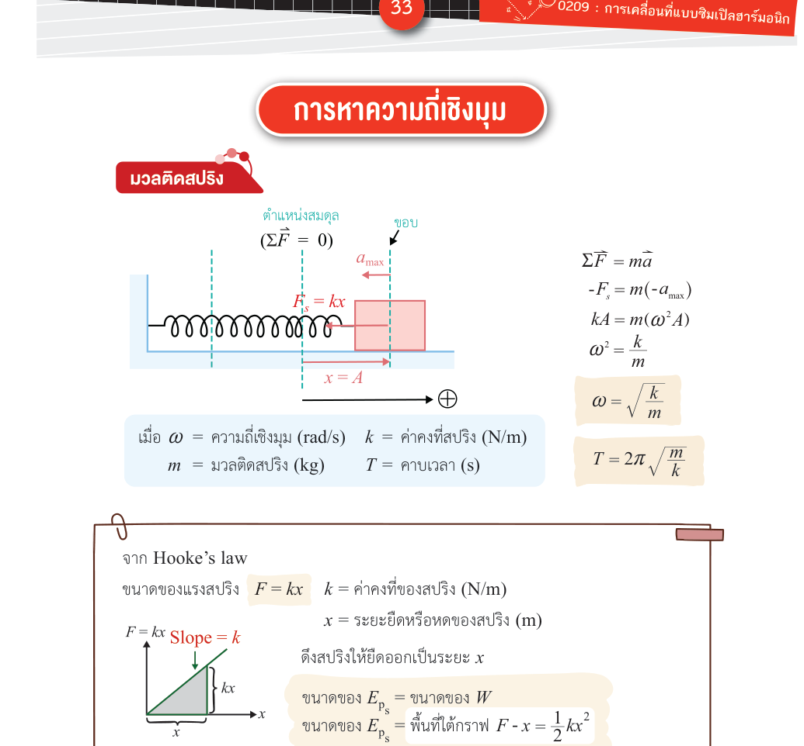

# มวลติดสปริง — ความถี่เชิงมุมและคาบ

**Summary**: การสั่นของมวลติดปลายสปริงในฐานะตัวอย่างของ SHM วิธีหา ω จากกฎฮุคและกฎข้อสองของนิวตัน พร้อมสูตรคาบและความถี่

**Curriculum anchor**:
- กลุ่มกลศาสตร์ › การเคลื่อนที่แบบฮาร์มอนิกอย่างง่าย › ความถี่เชิงมุมของการเคลื่อนที่แบบฮาร์มอนิกอย่างง่ายรูปแบบต่างๆ › การสั่นของมวลติดสปริง

**Level**: มัธยมปลาย

**Prerequisites**: [[shm-definition]], [[shm-equations-graphs]], [[newton-second-law]], [[hookes-law]]

**Sources**: (source: [IPST-Textbook]-SHM.pdf — authoritative), (source: [OE-S-Map]-SHM.pdf), (source: [IPST-Teacher-Manual]-SHM.pdf)

**Last updated**: 2026-05-15

---

## ทำไมมวลติดสปริงจึงเป็น SHM

เมื่อดึงมวลออกจากตำแหน่งสมดุลแล้วปล่อย สปริงออกแรงดึงกลับตาม **กฎฮุค (Hooke's law)**:

$$F_\text{spring} = -kx$$

เมื่อ $k$ คือค่าคงตัวของสปริง (N/m) และ $x$ คือการกระจัดจากสมดุล (m) เครื่องหมายลบแสดงว่าแรงมีทิศตรงข้ามกับการกระจัดเสมอ — นี่คือลักษณะของ **แรงดึงกลับ (restoring force)** (source: [IPST-Textbook]-SHM.pdf — authoritative)

---

*(มวล m ติดสปริงค่าคงตัว k บนพื้นลื่น — แรงเดียวที่กระทำคือ F = −kx ในแนวนอน; source: [OE-Textbook]-SHM.pdf)*

---

## หา ω จากกฎของนิวตัน

กฎข้อสองบอกว่า $\sum F = ma$ และตอนนี้มีแรงเดียวคือสปริง ดังนั้น:

$$-kx = ma$$

$$a = -\frac{k}{m}x$$

นิยาม SHM บอกว่า $a = -\omega^2 x$ (ดู [[shm-equations-graphs]]) เมื่อเทียบกัน:

$$\omega^2 = \frac{k}{m}$$

$$\boxed{\omega = \sqrt{\frac{k}{m}}}$$

(source: [IPST-Textbook]-SHM.pdf — authoritative)

---

## สูตรคาบและความถี่

จาก $\omega = \frac{2\pi}{T}$:

$$\boxed{T = 2\pi\sqrt{\frac{m}{k}}}$$

$$\boxed{f = \frac{1}{2\pi}\sqrt{\frac{k}{m}}}$$

---

## สมบัติสำคัญ

- **คาบขึ้นอยู่กับมวลและค่าคงตัวสปริงเท่านั้น** — ไม่ขึ้นกับแอมพลิจูด วัตถุที่สั่นกว้างหรือแคบก็ใช้เวลาต่อรอบเท่ากัน
- มวลมากขึ้น → คาบนานขึ้น (สั่นช้าลง)
- สปริงแข็งขึ้น (k มาก) → คาบสั้นลง (สั่นเร็วขึ้น)

---

## ตัวอย่างการคำนวณ

**โจทย์**: วัตถุมวล 0.5 kg ติดอยู่กับปลายสปริงที่มีค่าคงตัวสปริง 5.0 N/m อยู่บนพื้นลื่น เมื่อดึงวัตถุออกจากตำแหน่งสมดุลแล้วปล่อย คาบการเคลื่อนที่เป็นเท่าใด

**วิธีทำ**:

$$T = 2\pi\sqrt{\frac{m}{k}} = 2\pi\sqrt{\frac{0.5\text{ kg}}{5.0\text{ N/m}}} \approx 1.99\text{ s}$$

(source: [IPST-Textbook]-SHM.pdf — authoritative)

---

## ระบบกันสะเทือนในยานพาหนะ

สปริงในระบบกันสะเทือน (suspension system) ของรถยนต์ทำงานตามหลักการเดียวกัน ขดลวดสปริงรับน้ำหนักรถและแรงกระแทกจากพื้นถนน ทำให้ตัวรถสั่นด้วยลักษณะคล้าย SHM อย่างไรก็ตาม ในทางปฏิบัติต้องติดตั้ง **โช้คอัพ (shock absorber)** เพื่อลดการสั่นไม่ให้ต่อเนื่องนานเกินไป (source: [IPST-Textbook]-SHM.pdf — authoritative)

---

## ความเข้าใจคลาดเคลื่อนที่พบบ่อย

| ❌ เข้าใจผิด | ✅ ที่ถูกต้อง |
|---|---|
| ดึงมวลออกมามากกว่า (แอมพลิจูดมาก) → คาบนานกว่า | $T = 2\pi\sqrt{m/k}$ ไม่มี $A$ อยู่เลย คาบไม่เปลี่ยนไม่ว่าจะดึงมากหรือน้อย |
| ความเร็วของมวลมีทิศทางเดียวกับการกระจัดเสมอ | ไม่จริง เช่น ขณะมวลอยู่ทางขวา ($x > 0$) แต่กำลังวิ่งกลับซ้าย — ทิศของ $v$ ตรงข้ามกับ $x$ |

(source: [IPST-Teacher-Manual]-SHM.pdf)

## Related pages

- [[shm-definition]]
- [[shm-equations-graphs]]
- [[shm-pendulum]]
- [[shm-other-forms]]
